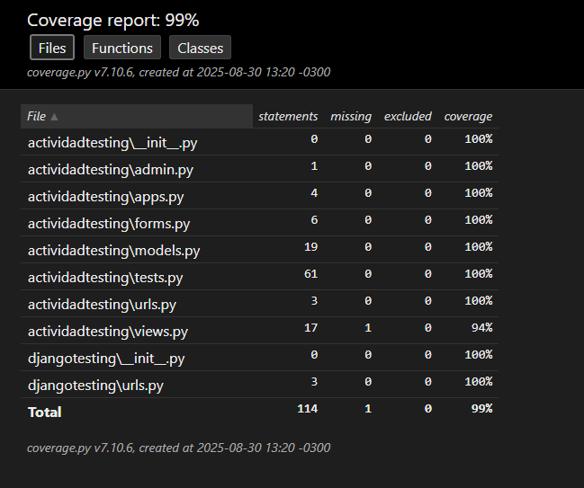

# Actividad Práctica Profesionalizante: Testing en Django
Se debe realizar el testing completo de una app en Django, utilizando coverage.py se debe obtener al menos un 80% de covertura.

La app consiste en una simple biblioteca, posee los modelos de Libro y Autor. Las vistas permiten ver una lista de libros, ver los detalles de un libro, y crear un libro. Los tests cubren cada una de las funcionalidades

## Resultado coverage



## Ejecutar el proyecto
### Clonar el repositorio
```bash 
git clone 
```
```bash
cd actividad_testing
```
### Crear entorno virtual
```bash
python -m venv env
env\scripts\activate
```

### Instalar paquetes
```bash
pip install Django 
pip install coverage
```

### Correr migraciones
```bash
manage.py makemigrations
manage.py migrate
```

### Correr script para agregar autores
```bash
manage.py populate_autores
```

### Ejecutar el proyecto
```bash
manage.py runserver
```